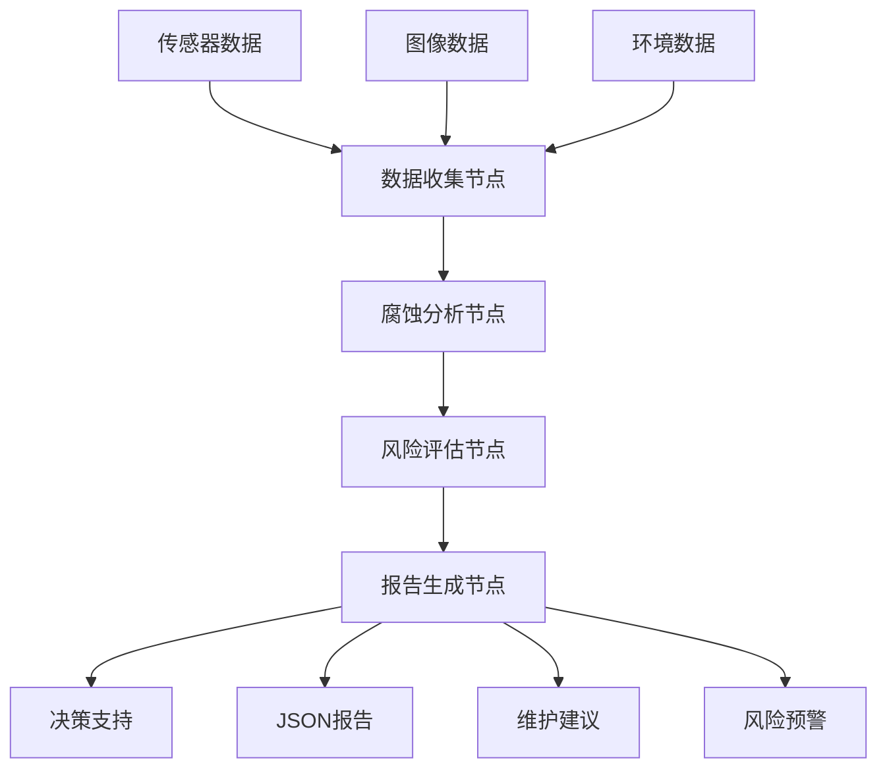

# 海上石油平台腐蚀检测Agent

基于LangGraph的智能腐蚀检测系统，专门用于海上石油平台的腐蚀监测和风险评估。

## 🎯 项目概述

本项目利用LangGraph框架构建了一个多节点的智能Agent系统，集成了阿里百炼平台的qwen-plus模型，能够：

- 🔍 **智能数据收集**: 自动收集和处理多源传感器数据
- 🖼️ **图像分析**: 基于计算机视觉的腐蚀检测和分析
- 🤖 **LLM增强分析**: 基于qwen-plus的智能腐蚀分析和洞察
- ⚠️ **风险评估**: 多因素综合风险评估和等级判定
- 📊 **智能报告**: LLM增强的专业报告生成和维护建议
- 🔄 **工作流管理**: 基于LangGraph的状态管理和流程编排

## 🏗️ 系统架构



## ✨ 主要功能

### 1. 多源数据收集
- **传感器数据**: 厚度、温度、湿度、pH值、电导率
- **图像数据**: 自动预处理、增强和特征提取
- **环境参数**: 海洋环境条件监测

### 2. 智能腐蚀分析
- **计算机视觉**: HSV颜色空间腐蚀检测
- **深度估算**: 基于图像特征的腐蚀深度评估
- **类型识别**: 局部腐蚀、点蚀、均匀腐蚀分类
- **数据融合**: 传感器数据与图像分析结果融合
- **🤖 LLM增强**: 基于阿里百炼qwen-plus的智能分析和洞察

### 3. 综合风险评估
- **多因子分析**: 面积、深度、数量、环境因子综合评估
- **等级划分**: LOW/MEDIUM/HIGH/CRITICAL四级风险等级
- **动态阈值**: 可配置的风险评估阈值
- **趋势分析**: 基于历史数据的腐蚀趋势预测

### 4. 智能报告生成
- **自动化报告**: JSON格式的标准化检测报告
- **可视化结果**: 腐蚀区域标注和统计图表
- **维护建议**: 基于风险等级的具体维护措施
- **时间规划**: 智能的下次检测时间建议

## 🚀 快速开始

### 系统要求
- Python 3.8+
- 8GB+ RAM （推荐）
- 支持OpenCV的系统

### 安装步骤

1. **克隆项目**
```bash
git clone https://github.com/swanmsg/CorrosionAssessmentAgent
cd CorrosionAssessmentAgent
```

2. **创建虚拟环境**
```bash
conda create -n corrosion-agent python=3.8
conda activate corrosion-agent
```

3. **安装依赖**
```bash
pip install -r requirements.txt
```

4. **配置环境**
```bash
cp .env.example .env
# 编辑.env文件配置必要参数
```

### 快速体验

**运行演示模式**：
```bash
python main.py demo
```

**体验阿里百炼qwen-plus增强功能**：
```bash
python demo_with_llm.py
```

**自定义检测**：
```bash
python main.py --platform-id PLATFORM_001 --area "甲板区域A"
```

**使用自定义数据**：
```bash
python main.py --platform-id PLATFORM_002 --area "管道区域B" \
  --images image1.jpg image2.jpg --sensors sensor_data.json
```

## 💻 编程接口

### 基础使用

```python
from src.agents.corrosion_agent import CorrosionDetectionAgent

# 创建Agent实例
agent = CorrosionDetectionAgent()

# 执行检测
result = agent.run_inspection_sync(
    platform_id="MY_PLATFORM",
    inspection_area="甲板区域"
)

# 查看结果
print(f"风险等级: {result.risk_assessment.corrosion_level.value}")
print(f"腐蚀点数量: {len(result.corrosion_detections)}")
```

### 异步使用

```python
import asyncio

async def async_inspection():
    agent = CorrosionDetectionAgent()
    result = await agent.run_inspection(
        platform_id="MY_PLATFORM",
        inspection_area="甲板区域"
    )
    return result

result = asyncio.run(async_inspection())
```

### 批量处理

```python
def batch_inspection(platforms):
    agent = CorrosionDetectionAgent()
    results = []
    
    for platform_id, area in platforms:
        result = agent.run_inspection_sync(
            platform_id=platform_id,
            inspection_area=area
        )
        results.append(result)
        
        # 检查高风险情况
        if result.risk_assessment:
            level = result.risk_assessment.corrosion_level.value
            if level in ["HIGH", "CRITICAL"]:
                print(f"⚠️ 平台 {platform_id} 发现{level}风险!")
    
    return results

# 批量检测
platforms = [
    ("PLATFORM_A", "甲板区域"),
    ("PLATFORM_B", "管道区域"), 
    ("PLATFORM_C", "储罐区域")
]

results = batch_inspection(platforms)
```

## 📊 输出示例

### 检测报告 (JSON格式)

```json
{
  "report_id": "report_session_123",
  "timestamp": "2024-01-15T10:30:00",
  "platform_id": "PLATFORM_001",
  "area_inspected": "甲板区域A",
  "corrosion_detections": [
    {
      "detection_id": "detection_img_001",
      "corrosion_area": 250.5,
      "corrosion_depth": 1.2,
      "corrosion_type": "局部腐蚀",
      "confidence": 0.85
    }
  ],
  "risk_assessment": {
    "corrosion_level": "MEDIUM",
    "risk_score": 0.45,
    "urgency": "中等",
    "recommendations": [
      "增加检测频率至每3个月一次",
      "对检测到的腐蚀区域进行局部处理"
    ]
  },
  "maintenance_recommendations": [
    {
      "priority": 3,
      "action_type": "修复性维护",
      "description": "对腐蚀区域进行局部修复和重新涂装",
      "estimated_cost": 15000.0,
      "estimated_duration": 24
    }
  ],
  "next_inspection_date": "2024-04-15T10:30:00"
}
```

### 控制台输出

```
🚀 开始腐蚀检测: 平台=PLATFORM_001, 区域=甲板区域A
📋 数据收集完成: 传感器数据 5 条, 图像数据 3 张
🔍 腐蚀分析完成: 检测到 2 个腐蚀点
⚠️  风险评估完成: 风险等级 MEDIUM
📊 报告生成完成: report_session_123

✅ 检测完成! 会话ID: session_123
📊 报告已保存到: outputs/reports/report_session_123.json
🎯 风险等级: MEDIUM
```

## 🔍 测试

### 运行全部测试
```bash
python -m pytest tests/ -v
```

### 运行特定测试
```bash
python -m pytest tests/test_corrosion_agent.py::TestCorrosionDetectionAgent -v
```

### 运行示例程序
```bash
python examples/demo.py
```

## 📁 项目结构

```
CorrosionAssessment_Agent/
├── src/                    # 源代码
│   ├── agents/            # Agent节点实现
│   │   ├── corrosion_agent.py
│   │   └── nodes.py
│   ├── models/            # 数据模型
│   │   └── data_models.py
│   ├── utils/             # 工具函数
│   │   ├── image_processor.py
│   │   └── sensor_reader.py
│   └── config/            # 配置管理
│       └── settings.py
├── data/                  # 数据文件
│   ├── sample/            # 示例数据
│   └── models/            # 预训练模型
├── tests/                 # 测试代码
│   └── test_corrosion_agent.py
├── examples/              # 使用示例
│   └── demo.py
├── docs/                  # 文档
│   ├── API.md
│   └── QUICKSTART.md
├── outputs/               # 输出结果
│   ├── reports/           # 检测报告
│   └── processed_images/  # 处理后的图像
├── main.py                # 主程序入口
├── requirements.txt       # 依赖列表
├── .env.example           # 环境配置示例
└── README.md             # 项目说明
```

## 🌟 特性亮点

- ✅ **模块化设计**: 基于LangGraph的清晰节点分离
- ✅ **异步支持**: 同时支持同步和异步执行模式
- ✅ **数据融合**: 多源传感器数据与图像分析的智能融合
- ✅ **配置灵活**: 基于Pydantic的环境配置管理
- ✅ **全面测试**: 包含单元测试和集成测试
- ✅ **丰富文档**: 完整的API文档和使用指南
- ✅ **可扩展性**: 易于添加新的传感器类型和分析算法

## 🔧 技术栈

- **核心框架**: LangGraph, LangChain
- **LLM模型**: 阿里百炼 qwen-plus (主要), OpenAI GPT-4 (备用)
- **数据处理**: NumPy, Pandas, OpenCV
- **图像处理**: OpenCV, Pillow, Matplotlib
- **配置管理**: Pydantic, python-dotenv
- **测试框架**: pytest, pytest-asyncio
- **日志系统**: loguru

## 📈 性能优化

- **并发处理**: 支持多平台并发检测
- **数据缓存**: 查询结果缓存机制
- **批量处理**: 支持批量传感器数据分析
- **资源管理**: 合理的内存和计算资源使用

## 🔗 扩展开发

### 添加新的传感器类型

```python
# 在models/data_models.py中添加
class SensorType(str, Enum):
    # 现有类型...
    VIBRATION = "vibration"  # 新增振动传感器
```

### 自定义腐蚀检测算法

```python
class CustomCorrosionAnalysisNode(CorrosionAnalysisNode):
    def _analyze_image(self, image_data, area):
        # 实现自定义的腐蚀检测算法
        # 可以集成深度学习模型
        pass
```

## 📄 文档

- 🚀 [**快速开始指南**](docs/QUICKSTART.md) - 安装和基础使用
- 📚 [**API文档**](docs/API.md) - 详细的技术文档和使用示例
- 📝 [**示例代码**](examples/) - 完整的使用示例
- 🧪 [**测试用例**](tests/) - 单元测试和集成测试

## 👏 贡献指南

欢迎提交Issue和Pull Request来改进这个项目！

1. Fork 这个仓库
2. 创建特性分支 (`git checkout -b feature/AmazingFeature`)
3. 提交更改 (`git commit -m 'Add some AmazingFeature'`)
4. 推送到分支 (`git push origin feature/AmazingFeature`)
5. 开启 Pull Request

## 📜 许可证

MIT License - 详见 [LICENSE](LICENSE) 文件

## 📧 联系方式

如有问题或建议，请通过以下方式联系：

- 提交 GitHub Issue
- 邮件联系：[your-email@example.com]

---

⭐ 如果这个项目对您有帮助，请给个 Star 支持一下！
