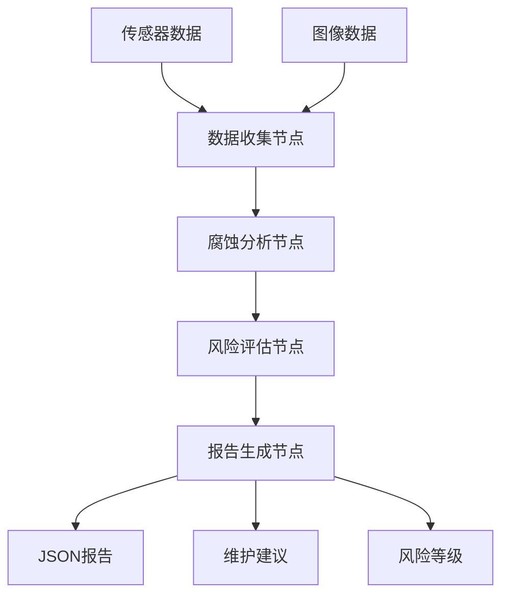

# 腐蚀检测Agent API文档

## 概述

本系统基于LangGraph框架，提供了一套完整的海上石油平台腐蚀检测解决方案。系统采用多节点工作流设计，能够自动完成数据收集、腐蚀分析、风险评估和报告生成。

## 系统架构



## 核心组件

### 1. CorrosionDetectionAgent

主要的Agent类，协调整个检测流程。

```python
from src.agents.corrosion_agent import CorrosionDetectionAgent

# 创建Agent实例
agent = CorrosionDetectionAgent()

# 异步运行检测
result = await agent.run_inspection(
    platform_id="PLATFORM_001",
    inspection_area="甲板区域A",
    image_files=["path/to/image1.jpg", "path/to/image2.jpg"],
    sensor_files=["path/to/sensor_data.json"]
)

# 同步运行检测
result = agent.run_inspection_sync(
    platform_id="PLATFORM_001", 
    inspection_area="甲板区域A"
)
```

### 2. 数据模型

系统定义了完整的数据模型来表示检测过程中的各种数据：

#### AgentState
系统的核心状态类，包含了整个检测流程的状态信息：

```python
class AgentState(BaseModel):
    session_id: str                           # 会话ID
    current_step: str                         # 当前执行步骤
    platform_id: str                         # 平台ID
    inspection_area: str                      # 检测区域
    sensor_readings: List[SensorData]         # 传感器读数
    image_files: List[str]                    # 图像文件路径
    processed_images: List[ImageData]         # 处理后的图像数据
    corrosion_detections: List[CorrosionDetection]  # 腐蚀检测结果
    risk_assessment: Optional[RiskAssessment] # 风险评估
    final_report: Optional[InspectionReport]  # 最终报告
```

#### SensorData
传感器数据模型：

```python
class SensorData(BaseModel):
    sensor_id: str                            # 传感器ID
    sensor_type: SensorType                   # 传感器类型
    value: float                              # 测量值
    unit: str                                 # 单位
    timestamp: datetime                       # 时间戳
    location: Dict[str, float]                # 位置坐标
    quality: float                            # 数据质量评分
```

支持的传感器类型：
- `THICKNESS`: 厚度传感器
- `CONDUCTIVITY`: 电导率传感器  
- `TEMPERATURE`: 温度传感器
- `HUMIDITY`: 湿度传感器
- `PH`: pH传感器
- `PRESSURE`: 压力传感器

#### CorrosionDetection
腐蚀检测结果：

```python
class CorrosionDetection(BaseModel):
    detection_id: str                         # 检测ID
    image_id: Optional[str]                   # 关联图像ID
    corrosion_area: float                     # 腐蚀面积(平方毫米)
    corrosion_depth: float                    # 腐蚀深度(毫米)
    corrosion_type: str                       # 腐蚀类型
    confidence: float                         # 检测置信度
    bounding_boxes: List[Dict[str, int]]      # 边界框坐标
    timestamp: datetime                       # 检测时间
```

#### RiskAssessment
风险评估结果：

```python
class RiskAssessment(BaseModel):
    assessment_id: str                        # 评估ID
    corrosion_level: CorrosionLevel           # 腐蚀等级
    risk_score: float                         # 风险评分(0-1)
    factors: Dict[str, float]                 # 影响因素权重
    recommendations: List[str]                # 建议措施
    urgency: str                              # 紧急程度
    timestamp: datetime                       # 评估时间
```

风险等级定义：
- `LOW`: 低风险 (score < 0.3)
- `MEDIUM`: 中等风险 (0.3 <= score < 0.6)
- `HIGH`: 高风险 (0.6 <= score < 0.8)
- `CRITICAL`: 严重风险 (score >= 0.8)

## 工作流节点

### 1. DataCollectionNode
负责收集和预处理传感器数据和图像数据。

**功能：**
- 从多种传感器收集数据
- 图像预处理和质量增强
- 生成示例数据（用于演示）

**输入：** 传感器文件路径、图像文件路径
**输出：** 处理后的传感器读数和图像数据

### 2. CorrosionAnalysisNode
执行腐蚀检测和分析。

**功能：**
- 基于计算机视觉的腐蚀检测
- 腐蚀面积和深度计算
- 腐蚀类型分类
- 与传感器数据融合分析

**算法：**
- HSV颜色空间铁锈检测
- 形态学操作降噪
- 轮廓分析和边界框提取

### 3. RiskAssessmentNode
评估腐蚀风险等级。

**评估因子：**
- 腐蚀面积因子 (权重30%)
- 腐蚀深度因子 (权重40%)
- 腐蚀数量因子 (权重20%)
- 环境因子 (权重10%)

**环境因子计算：**
- 温度影响 (15-35°C范围)
- 湿度影响 (60-90%RH范围)
- pH值影响 (偏离8.0的程度)

### 4. ReportGenerationNode
生成最终的检测报告。

**报告内容：**
- 检测摘要
- 腐蚀检测结果详情
- 风险评估结果
- 维护建议
- 下次检测时间建议

## 配置管理

系统使用pydantic-settings进行配置管理，支持环境变量和配置文件。

### 环境变量配置

创建`.env`文件：

```bash
# 阿里百炼API配置
DASHSCOPE_API_KEY=your_dashscope_api_key_here
QWEN_MODEL=qwen-plus

# 可选的OpenAI配置（向后兼容）
# OPENAI_API_KEY=your_openai_api_key_here
# OPENAI_MODEL=gpt-4

# 模型配置
CORROSION_MODEL_PATH=data/models/corrosion_detector.pth
IMAGE_MODEL_PATH=data/models/image_classifier.pth

# 数据路径
DATA_ROOT_PATH=data/
SAMPLE_DATA_PATH=data/sample/
OUTPUT_PATH=outputs/

# 日志配置
LOG_LEVEL=INFO
LOG_FILE=logs/corrosion_agent.log

# 风险阈值
LOW_RISK_THRESHOLD=0.3
MEDIUM_RISK_THRESHOLD=0.6
HIGH_RISK_THRESHOLD=0.8
```

### 配置访问

```python
from src.config import config

# 访问配置
print(f"数据路径: {config.data_root_path}")
print(f"低风险阈值: {config.low_risk_threshold}")

# 获取风险等级
risk_level = config.get_risk_level(0.5)  # 返回 "MEDIUM"
```

## 使用示例

### 基础使用

```python
import asyncio
from src.agents.corrosion_agent import CorrosionDetectionAgent

async def basic_inspection():
    agent = CorrosionDetectionAgent()
    
    result = await agent.run_inspection(
        platform_id="PLATFORM_001",
        inspection_area="主甲板"
    )
    
    print(f"检测完成: {result.session_id}")
    if result.risk_assessment:
        print(f"风险等级: {result.risk_assessment.corrosion_level.value}")

# 运行
asyncio.run(basic_inspection())
```

### 使用自定义数据

```python
# 准备传感器数据文件
sensor_data = [
    {
        "sensor_id": "thickness_001",
        "sensor_type": "thickness", 
        "value": 9.5,
        "unit": "mm",
        "timestamp": "2024-01-15T10:30:00",
        "location": {"x": 0, "y": 0, "z": 0},
        "quality": 0.95
    }
]

# 保存到文件
import json
with open("my_sensor_data.json", "w") as f:
    json.dump(sensor_data, f)

# 运行检测
result = agent.run_inspection_sync(
    platform_id="PLATFORM_002",
    inspection_area="储罐区域",
    sensor_files=["my_sensor_data.json"],
    image_files=["corrosion_image.jpg"]
)
```

### 批量检测

```python
def batch_inspection(platforms):
    agent = CorrosionDetectionAgent()
    results = []
    
    for platform_id, area in platforms:
        result = agent.run_inspection_sync(
            platform_id=platform_id,
            inspection_area=area
        )
        results.append(result)
        
        print(f"平台 {platform_id} 检测完成")
        if result.risk_assessment:
            level = result.risk_assessment.corrosion_level.value
            if level in ["HIGH", "CRITICAL"]:
                print(f"⚠️ 平台 {platform_id} 发现{level}风险!")
    
    return results

# 检测多个平台
platforms = [
    ("PLATFORM_A", "甲板区域"),
    ("PLATFORM_B", "管道区域"), 
    ("PLATFORM_C", "储罐区域")
]

results = batch_inspection(platforms)
```

## 🤖 LLM增强功能

系统集成了阿里百炼平台的qwen-plus模型，提供智能化的分析和报告生成功能。

### LLM服务功能

1. **智能腐蚀分析**
   - 基于多源数据的深度分析
   - 腐蚀成因和发展趋势预测
   - 专业的技术洞察和建议

2. **增强报告摘要**
   - 专业级别的报告摘要生成
   - 符合工业标准的表达方式
   - 适合管理层阅读的内容

3. **智能维护建议**
   - 基于风险等级的个性化建议
   - 具体的执行步骤和资源需求
   - 考虑海上作业特殊性

### 使用LLM服务

```python
from src.utils.llm_service import llm_service

# 腐蚀数据分析
analysis = llm_service.analyze_corrosion_data(sensor_data, detections)
print(f"严重程度: {analysis['severity_assessment']}")
print(f"技术洞察: {analysis['technical_insights']}")

# 生成增强摘要
summary = llm_service.generate_enhanced_report_summary(
    sensor_data, detections, risk_assessment, 
    platform_id, inspection_area
)

# 维护建议生成
insights = llm_service.generate_maintenance_insights(risk_assessment)
for insight in insights:
    print(f"- {insight}")
```

### 配置阿里百炼

1. **获取API Key**
   - 登录阿里云控制台
   - 开通百炼平台服务
   - 创建并获取API Key

2. **设置环境变量**
```bash
export DASHSCOPE_API_KEY=your_api_key_here
export QWEN_MODEL=qwen-plus
```

3. **安装依赖**
```bash
pip install dashscope>=1.14.0
```

### 回退机制

当LLM服务不可用时，系统会自动回退到传统分析方法，确保系统的可靠性。

## 输出格式

### 检测报告JSON格式

```json
{
  "report_id": "report_session_123",
  "timestamp": "2024-01-15T10:30:00",
  "inspector": "Corrosion Detection Agent",
  "platform_id": "PLATFORM_001",
  "area_inspected": "甲板区域A",
  "sensor_data": [...],
  "image_data": [...],
  "corrosion_detections": [
    {
      "detection_id": "detection_img_001",
      "corrosion_area": 250.5,
      "corrosion_depth": 1.2,
      "corrosion_type": "局部腐蚀",
      "confidence": 0.85,
      "bounding_boxes": [{"x": 100, "y": 50, "w": 80, "h": 60}]
    }
  ],
  "risk_assessment": {
    "corrosion_level": "MEDIUM",
    "risk_score": 0.45,
    "urgency": "中等"
  },
  "maintenance_recommendations": [...],
  "summary": "检测区域: 甲板区域A\n检测时间: 2024-01-15 10:30:00\n...",
  "next_inspection_date": "2024-04-15T10:30:00"
}
```

## 错误处理

系统提供了完善的错误处理机制：

```python
result = await agent.run_inspection(
    platform_id="PLATFORM_001",
    inspection_area="测试区域"
)

# 检查错误
if result.errors:
    print("检测过程中的错误:")
    for error in result.errors:
        print(f"- {error}")

# 检查警告
if result.warnings:
    print("警告信息:")
    for warning in result.warnings:
        print(f"- {warning}")
```

## 性能优化建议

1. **并发处理**: 使用异步模式处理多个平台检测
2. **缓存机制**: 对重复的图像处理结果进行缓存
3. **批量处理**: 合并多个传感器读数进行批量分析
4. **资源限制**: 设置合理的超时时间和内存限制

## 扩展开发

### 添加新的传感器类型

```python
# 1. 在models/data_models.py中添加新类型
class SensorType(str, Enum):
    # 现有类型...
    VIBRATION = "vibration"  # 新增振动传感器

# 2. 在DataCollectionNode中添加处理逻辑
def _generate_vibration_readings(self, area: str) -> List[SensorData]:
    # 实现振动传感器数据生成
    pass
```

### 自定义腐蚀检测算法

```python
class CustomCorrosionAnalysisNode(CorrosionAnalysisNode):
    def _analyze_image(self, image_data: ImageData, area: str) -> Optional[CorrosionDetection]:
        # 实现自定义的腐蚀检测算法
        # 可以集成深度学习模型
        pass
```

### 集成外部API

```python
# 在风险评估中集成天气API
def _get_weather_factor(self, location: Dict[str, float]) -> float:
    # 调用天气API获取环境数据
    # 返回天气影响因子
    pass
```

## 故障排除

### 常见问题

1. **导入错误**: 确保安装了所有依赖包
2. **配置问题**: 检查.env文件是否正确配置
3. **权限问题**: 确保对输出目录有写权限
4. **内存不足**: 处理大量图像时可能需要增加内存
5. **模型加载失败**: 检查模型文件路径是否正确

### 调试模式

```python
# 启用详细日志
import logging
logging.basicConfig(level=logging.DEBUG)

# 设置环境变量
import os
os.environ["LOG_LEVEL"] = "DEBUG"
```